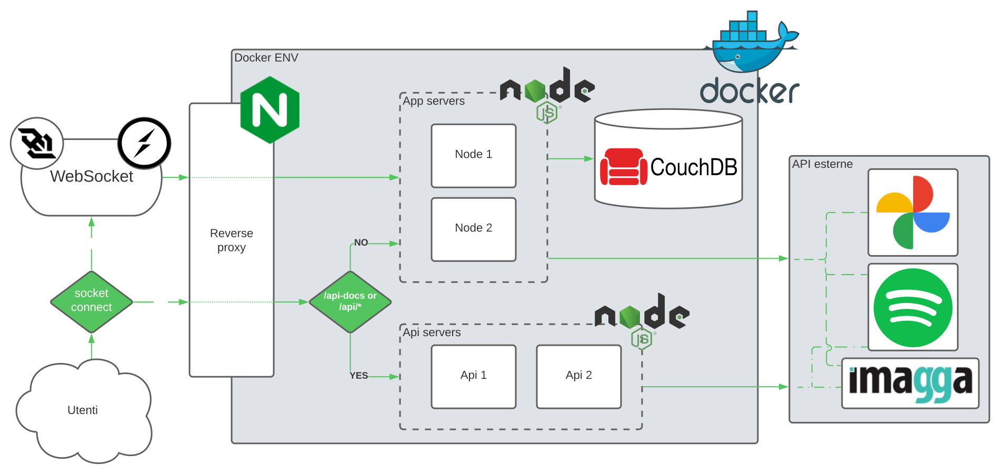
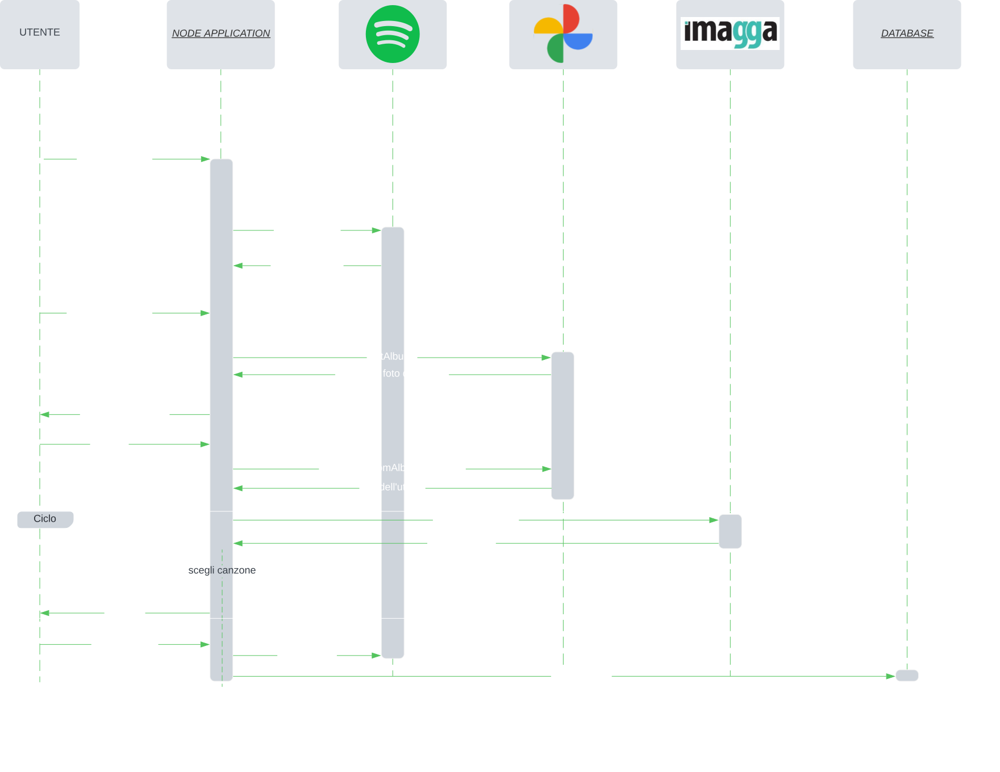

# Pho2Song


[](https://www.codefactor.io/repository/github/zeplicious/pho2song/overview/main)


## Scopo del progetto

__Pho2Song__ è una web application che gira in un environment NodeJS che si occupa di __trasformare le foto in canzoni__. Attraverso la funzionalità principale, __Photo to Song__, 
è infatti possibile inviare al server un numero arbitrario di foto, con 3 diversi metodi (tramite file scelti da file system, tramite link URL o tramite album fotografici presi da Google Photo)
e ottenere come risposta lo stesso numero di canzoni, una per ogni foto, che il server ha calcolato tramite un algoritmo che associa i colori estratti dalle foto ai gusti musicali dell'utente per ottenere
le canzoni in output. La piattaforma dalla quale vengono estratti e analizzati i gusti musicali dell'utente è Spotify, la stessa piattaforma che ospita poi le playlist che l'utente ha la possibilità di creare
una volta ottenute le canzoni.

Le potenzialità di Pho2Song però non si limitano a questo. Grazie alla seconda funzionalità, __Playlist Analyzer__, l'utente ha la possibilità di analizzare le proprie playlist Spotify e ottenere una infarinatura generale
sulle caratteristiche musicali di tale playlist. Si possono, per esempio, leggere i valori di acustica, ballabilità ed energia medie e capire in questo modo quale playlist si addice meglio a determinate situazioni ed eventi.
E' ovviamente possibile utilizzare questa funzionalità anche sulle playlist generate grazie alla funzionalità principale.

Infine l'utente ha la possibilità di visualizzare uno storico delle playlist che ha creato grazie a Pho2Song nel corso del tempo. Questo è lo scopo della terza e ultima funzionalità, __Playlist History__, che sfrutta un database documentale
come CouchDB per tenere traccia di tutte le playlist create da un utente. Ogni file contiene il nome della playlist creata su Pho2SOng, l'ID che la playlist ha su Spotify, l'ID Spotify dell'utente, la descrizione della playlist (campo opzionale), il numero di canzoni nella playlist e infine un array di oggetti `songs`, dove ogni oggetto è formato da un oggetto `song` e una stringa `photo`. All'interno dell'oggetto `song` troviamo una stringa che rappresenta l'uri della canzone e una stringa con il nome di quest'ultima
Tutti i campi sono salvati per rendere di facile accesso i file in caso di inserzione, modifica o rimozione e per rendere comprensibile all'utente il processo che ha portato alla creazione di una playlist. Ad ogni canzone all'interno della playlist è infatti associata la foto dalla quale è stata generata, in modo che all'untente risulti tutto il più chiaro e trasparente possibile.

---

## Architettura di riferimento



---

## Requisti

1. __Il servizio REST che implementate (lo chiameremo SERV) deve offrire a terze parti delle API documentate.__ (requisito 1)
    - La nostra webapp offre API (documentate di seguito), in particolare è possibile:
        1. analizzare un album o una playlist di spotify.
        2. a partire da un album o una playlist di spotify, richiedere una canzone da accoppiare ad una foto.
        3. a partire da un album o una playlist di spotify, richiedere una canzone da accoppiare ad una palette di colori.

2. __SERV si deve interfacciare con almeno due servizi REST di terze parti (e.g. google maps).__ (requisiti 2, 3, 4)
    - La nostra webapp utilizza le seguenti API esterne:
        1. Spotify: OAuth tramite passport, servizi tramite libreria SpotifyWebApi.
        2. Google Foto: OAuth tramite passport
        3. Imagga
    - Flow della funzionalità principale:



3. __La soluzione deve prevedere l'uso di protocolli asincroni. Per esempio Websocket e/o AMQP (o simili es MQTT).__ (requisito 5)
    - La nostra webapp implementa il protocollo Websocket tramite l'utilizo delle libreria Socket.io
    - Ne fa utilizzo sia nella funzionalità principale per permette al server di mandare le canzoni scelte all'utente, sia nella funzionalità secondaria di analisi delle playlist ( l'utente manda l'id, il server risponde con l'analisi).

4. __Il progetto deve prevedere l'uso di Docker e l'automazione del processo di lancio, configurazione e test.__ (requisito 6)
    - La nostra webapp utilizza Docker:
        - Ogni entità della nostra rete è dockerizzata.
        - La creazione delle immagini e dei relativi container, e il setup di tutta la rete sono automatizzati tramite docker-compose.

5. __Deve essere implementata una forma di CI/CD per esempio con le Github Actions__ (requisito 8)
    - La nostra webapp implenta Github Actions per:
        - Testing automatico delle funzionalità della web app.
        - Testing automatico dei servizi API offerti.
        - Creazione e push su repository docker hub delle immagini relative a database, nodi app e nodi api (utilizzabili a pieno solo dal team di sviluppo photo2song) come fase deploy del CI/CD.

6. __Requisiti minimi di sicurezza devono essere considerati e documentati. Self-signed certificate sono più che sufficienti per gli scopi del progetto.__ (requisito 9)
    - La nostra webapp accetta solo richieste https autorizzate tramite l'utilizzo di Self-signed certificate.
    - E' presente una regola firewall che reinstrada le richieste http in entrata al reverse proxy in https.

---

## Installazione

- Sono necessari:
    - node.js
    - docker

- Eseguire un `git clone` del repository:

```
git clone https://github.com/Zeplicious/Pho2Song.git
```

e posizionarsi nella root directory del git.

- Creare una applicazione su [a link](https://console.cloud.google.com), inserire tra i callback uri `http://localhost:8080/google-login/callback` e `https://localhost:8080/google-login/callback` ed inserire tra i servizi abilitati Photos Library API.
- Creare una applicazione su [a link](https://developer.spotify.com/dashboard/applications) ed inserire tra i callback uri `http://localhost:8080/spotify/callback` e `https://localhost:8080/spotify/callback`.

### Api/App stand alone

- Creare un file `.env` da inserire nella directory `/app` strutturato come segue:

```
IMAGGA_CLIENT_ID=****************************
IMAGGA_CLIENT_SECRET=****************************

GOOGLE_CLIENT_ID=****************************
GOOGLE_CLIENT_SECRET=****************************

SPOTIFY_CLIENT_ID=****************************
SPOTIFY_CLIENT_SECRET=****************************

DB_USER=*****
DB_PASSWORD=****

SESSION_SECRET=****
```

- Spostarsi nella directory di interesse ed installare le dipendenze necessarie per il funzionamento inserendo in console:

```
cd /app
npm install
```

- Per avviare il server è sufficente scrivere in console:

```
npm start
```
- Per utilizzare l'app visitare `http://localhost:8080/`

**_NOTA:_** Per api il processo è analogo. (visitare l'endpoint `http://localhost:8080/api-docs`)

### CouchDB

**_NOTA:_** Se si ha installato CouchDB è possibile saltare questa sezione. E' importante inserire le credenziali del proprio database nel file `.env` nei campi `DB_USER` e `DB_PASSWORD` e mettere il database in ascolto sulla porta 5984 in localhost.


- Completare il file /docker/couchdb/test.Dockerfile inserendo le credenziali del database inserite nel file `.env`.
```
ENV COUCHDB_USER=<DB_USER>
ENV COUCHDB_PASSWORD=<DB_PASSWORD>
```

- Successivamente è sufficente inserire in console i seguenti comandi:

```
docker build -t pho2song:couchdb /docker/couchdb/test.Dockerfile
docker run -p 5984:5984 pho2song:couchdb
```

### Docker environment

- Gestire il file `.env` come spiegato nella sezione [api/app](#### Api/App stand alone).
- Completare il file `/docker/couchdb/test.Dockerfile` come spiegato nella sezione [couchdb](#### CouchDB).
- Generare un certificato SSL.
- Inserire in /docker/nginx/ssl `cert.pem` e `cert-key.pem`.
- Per testare environment docker è sufficente inserire in console:

```
docker-compose up
```

#### Docker environment (developers)

- Generare un certificato SSL.
- Inserire in /docker/nginx/ssl `cert.pem` e `cert-key.pem`.
- Per testare environment docker è sufficente inserire in console:

```
development.docker-compose up
```

---

## Istruzioni per il test

### Applicazione

Per testare l'applicazione:

partendo dalla directory root `Pho2Song` spostarsi nella cartella `app`

```
cd app
```

e digitare in console il comando:

```
npm test
```

Viene utilizzato il modulo `jest` per eseguire i test che hanno un tempo di esecuzione variabile. Lasciar andare il programma finchè non sono visibili i risultati dei test

### API

Per testare le chiamate API:

partendo dalla directory root `Pho2Song` spostarsi nella cartella `api`

```
cd api
```

e digitare in console il comando:

```
npm start
```

Anche in questo caso viene utilizzato il modulo `jest` per eseguire i test che hanno un tempo di esecuzione variabile. Lasciar andare il programma finchè non sono visibili i risultati dei test
